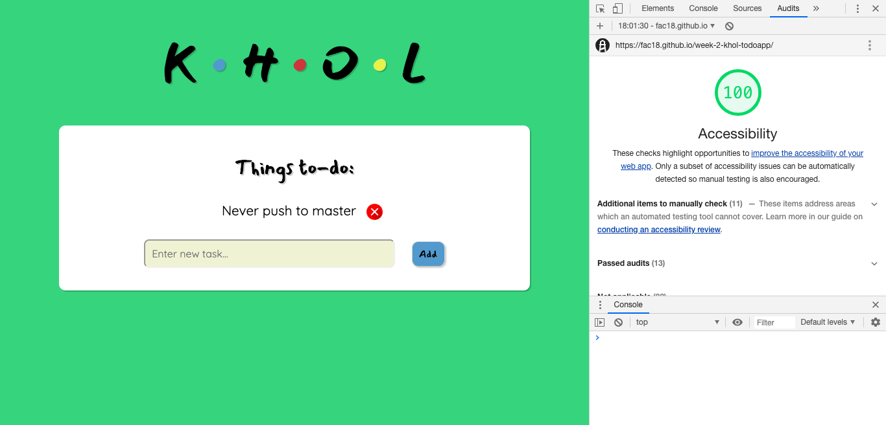

# week-2-khol-todoapp
To-do app

## Team:
 * [Ayub](https://github.com/Ayub3) 
 * [Jamie](https://github.com/jc282)
 * [Nikke](https://github.com/nikkesan)
 * [Renata](https://github.com/renatajarmova)
 
 ## Contents: 
* Tests for each function, 
* View your additions
* mark tasks as complete 
* delete any object you added.

## The purpose of the to-do app:
 - Use TDD  and understand in order to test our logic.
 - Render the to-do list to the DOM
 - Use CSS to make it look good.
 
## User stories completed 
- Enter tasks I need to do into a web page so that I don't forget them &#x2611;
- View the tasks I have added in a list so that I can plan my day &#x2611;
- Mark tasks as complete so that I can focus on the tasks I have left 


## get started:

1) clone our repo
2) run npm install

```
npm install
```

3) install Tape so that you can run your tests. 

``` npm i -D tape ``` and ``` npm i -D tap-spec ```

4) run npm test 

```
npm test
```


### Our stretch goals 
- We were not able to achieve any of our stretch goals


### What we achieved:
  - Understood the reasoning for testing and how to write different tests.
  - How to write pure functions
  - Made the to-do app look pretty
  - We got a score of 100% accessbility.
 
 ### What we struggled with: 
 - At first we were unable to pass 1 test and that was for the markTodo.
 - We all struggled with the rendering the DOM, which meant we ran out of time to make the markTodo function work. 
 - We should have made it more responsive.
 
### Accessibility screenshot:


  
 


